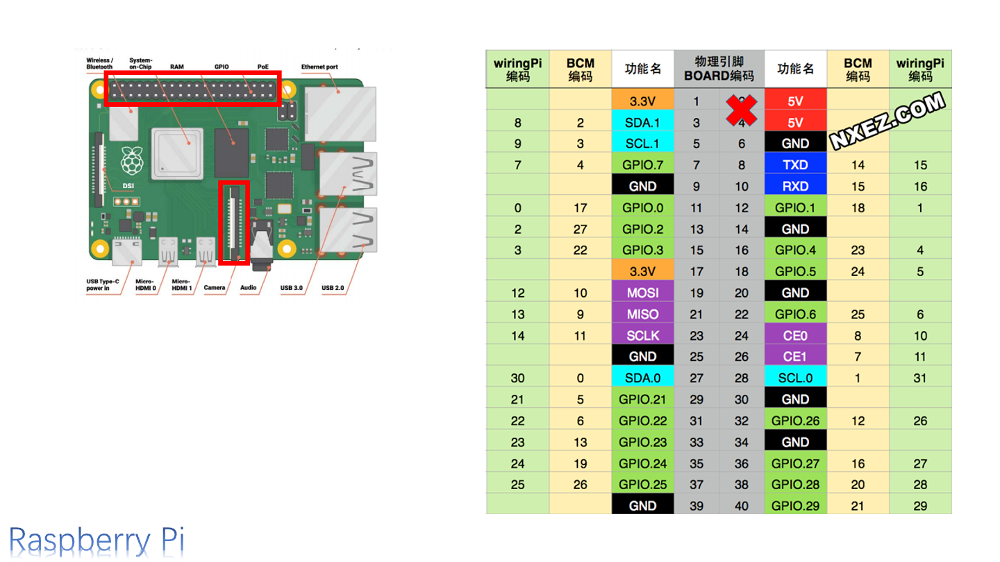
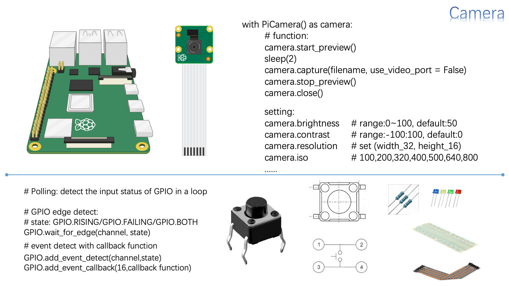

# 								SI100B-Report

## Team members and Division of Work

### Team members

- Zhangzhi Xiong  (熊章智)
- Tianni Yang        (杨天倪)
- Yixuan Chen	   (陈逸轩)

### Division of Work

## Text

### Main Content of the Project

#### Part 1: Some Preparations

The Project "hand-written number recognition" is  realized through hardwares and program. As for the hardware, we use a Raspberry Pi 3B+  as the remote control and a Pi camera attached to it. As for the program, the language we use is Python, and we will use the KNN algorithm in OpenCV, which is a typical method in the field of Image Processing. Besides these two parts, to realize the interaction between the hardwares and the real world, we have to build a circuit with LED light and LED digital tube added, so as to better tell us the moment of taking photos and the result of the algorithm. 

First of all, the most important thing is to understand how to operate the Raspberry Pi. We know that the Raspberry is a little computer with no screen or input device. As for the first stage, we will build a ***Remote Desktop*** through ***VNC***, in order to make it easy for us to write in programs and run our codes through our own computer. This may seem to be a little bit weird, but in fact, our computer only plays the role of displayer, and the running of codes is actually processed in the Raspberry Pi.  

To realize this, we have to assign an IP to the usb interface in order to connect the Raspberry with the computer, since that this operation puts two devices into one LAN. After that, all we have to do is to open the VNC app and initiate the connection.

Through these operations, we can manipulate the Raspberry Pi through the remote desktop on our own computer. 

#### Part 2: The Establishment of the Training Set

KNN algorithm requires training data. But before that, we must know how to process our pictures. The photos taken is colorful, but this is not what we want. First, we have to change our colorful pictures into the gray one. Picture is actually a matrix, containing the RGB information of every pixel. But we don't want the RGB colors, all we want is to use a gray level value to represent the pixel. Using the algorithm in the library OpenCV, it is easy to realize this:

````python 
grayImg = cv2.cvtColor(src, code)
# code can be  `cv2.COLOR_BGR2GRAY`,
# `cv2.COLOR_BGR2RGB`,`cv2.COLOR_BGR2HSV`.
````

After that, the colorful picture is converted to a ***gray scale picture***. To us the converted picture to generate training data set, we have to provide samples which contain the picture of each digit and the attached label to tell the true answer.  To split the picture into samples like that, we use the ***numpy*** library to realize that. With labels attached, the data are finally set up, ready to be used in the KNN algorithm. 

````python
# number detected related
import cv2
import os
import numpy as np
import math
from lib import imshow
import random
# get the project path
PRJ_PATH = os.getcwd()
# OPENCV_data.npz
TRAIN_DATA_NAME = "OPENCV_data.npz"
img = cv2.imread(PRJ_PATH+"/DigitsLib/digits.png")
grayImg = cv2.cvtColor(img,cv2.COLOR_BGR2GRAY)
cells = [np.hsplit(row,100) for row in np.vsplit(grayImg,50)]
cells = np.array(cells)
# Training set
train = cells[:,:].reshape(-1,400).astype(np.float32)
# Testing set
test = cells[:,50:100].reshape(-1,400).astype(np.float32)
k = np.arange(10) # [0, 1, 2, 3, 4, 5, 6, 7, 8, 9]
# Training set
train_labels = np.repeat(k, 5 * 100)[:,np.newaxis]
# Testing set
test_labels = np.repeat(k,5 * 50)[:,np.newaxis]
knn = cv2.ml.KNearest_create()
knn.train(train ,cv2.ml.ROW_SAMPLE , train_labels)
# Testing the training model
ret, result, neighbors, dist = knn.findNearest(test,k = 3)
matches = result==test_labels
correct = np.count_nonzero(matches)
accuracy = correct/result.size
print(f"{accuracy * 100: 0.02f}%")
# As for this case, when k=1, the accuracy would be 100%
# When k=3, the accuracy would be 97.56%

# Save your training model
fileName = os.path.join(PRJ_PATH, "TrainingData", TRAIN_DATA_NAME)
np.savez(fileName, train = train, train_labels = train_labels)
````

Pay special attention to the grammar when splitting the picture.

#### Part 3: Detecting the Numbers

At first, it is abstract for us to think how can we detect and extract the number out of the paper. But after knowing how and why, we will find it quite simple.

First we know that the white part of a gray scale picture is actually determined by the gray level of pixels. But how might we know where is the number? We have to grasp the information of the gray level. But the key problem is that the range of the gray level is from 0 to 255. We can't simply tell which pixel belongs to the number, for the values of gray level vary from each to each. So we have to use a process to 'force' that the gray level of each pixel can be only either 0 or 255. To realize this, we have to use a threshold to decide whether the gray level of a pixel is going to be changed into 0 or 255. 

Through this process, we change the gray scale picture into a ***binary*** one.

OK. Now we have a matrix, whose elements can only be 0 or 255. What to do next is quite clear. We have to scan the matrix from left to the right, detecting where the 0 changes into 255 (type 1) and where the 255 change into 0 (type 2). Not all changes of this kind should be recorded. When the change of type 1 is detected, what we seek for should be change of type 2. The area between the column of the index recorded in pair is in fact the number! Record the index of the column required, and this will help us split the matrix vertically. As for the rows, we do the similar things like that, so as to correctly split the matrix horizontally. First split the whole matrix vertically, then split every unit horizontally, and we will get the number matrix we want!

Remark that to further increase the accuracy, we make some adjustment to increase the width of  the black margin. All these functions are written in the file ***'my_function.py'*** .

````python
# Note that we make some adjustment in the code so as to increase the margin
def image_split_column(img:np.ndarray)->list:
    # find out the number of columns in the original image
    # create a list to record the number of elements with a value of 255 in each column
    column = img.shape[1]
    columnHist = np.zeros(column)    
    # initialize the variables
    flag = 0
    startList = []
    endList = []   
    ### write your codes here ###
    #############################
    # step1:
    # count the number of elements with a value of 255 in each column and record it in columnHist
    # record the location where the the number of 255 changes in startList and endList
    # record the status with flag
    for i in (range(column-1)):
        if 255 not in img[:,i]:
            if 255 in img[:,i+1]:
                startList.append(i)
        if 255 in img[:,i]:
            if 255 not in img[:,i+1]:
                endList.append(i+1)               
    # step 2:
    # following the startList and the endList, split the digits area from the original image.
    # there maybe several areas. recorder the areas in imgList and return imgList.
    imgList = [img[:,startList[i]-15:endList[i]+15] for i in range(len(startList))]

    ret = imgList
    return ret


def image_split_row(img:np.ndarray)->list:
    # find out the number of rows in the original image
    # create a list to record the number of elements with a value of 255 in each row
    row = img.shape[0]
    rowHist = np.zeros(row)    
    # initialize the variables
    flag = 0
    startList = []
    endList = []         
    ### write your codes here ###
    #############################
    # step1:
    # count the number of elements with a value of 255 in each row and record it in rowHist
    # record the location where the the number of 255 changes in startList and endList
    # record the status with flag
    for i in (range(row-1)):
        if 255 not in img[i,:]:
            if 255 in img[i+1,:]:
                startList.append(i)
        if 255 in img[i,:]:
            if 255 not in img[i+1,:]:
                endList.append(i+1)      
    # step 2:
    # following the startList and the endList, split the digits area from the original image.
    # there maybe several areas. recorder the areas in imgList and return imgList.    
    imgList = [img[startList[i]-15:endList[i]+15,:] for i in range(len(startList))]     
    ret = imgList
    return ret
````

#### Part 4: Detecting Multiple Line 

We have known the procedure to secure the numbers in a single line. But what about the multiple lines scenario? Actually it is quite easy. We simply split the large matrix into two parts, each containing a single line. After that, we use the function to process each line.

````python
rows = image_split_row(imgBin)
for p in range(len(rows)):
     imgCol = image_split_column(rows[p])
    print(f'The followings are the {p+1}th row')
    imshow(rows[p])
    imgMonos = []
    for col in range(0,len(imgCol)):
        imgMono = image_split_row(imgCol[col])
# The following code will be shown later in the report.  
````

#### Part 5:  Improving Accuracy

This is a harsh question: How can we improve the accuracy?  In the class, teacher gave us three hints: ***the segmentation range, threshold, and the parameter value of 'k' used in the KNN algorithm***.

 As for the segmentation, let's take a look back at the training data set. It's not hard to find that the samples have a black margin, which means that it is not going to be a single extraction. Yes, we have to add some black margin for the number extracted manually. Here we reach the goal through defining a ***function 'imgSqua()'***. The code is presented below.

````python 
# add black margin and change the matrix into a square one.
def imgSqua(img):
    (row,col) = img.shape
    m = max(row,col)
    new_matrix = np.zeros((m,m), dtype = np.uint8)
    row_start = (m-row)//2
    col_start = (m-col)//2
    new_matrix[row_start:row_start+row, col_start:col_start+col] = img
    return new_matrix
````

As for the threshold, there 

#### Part 6: Building the Circuit

First, we have to understand how GPIO works in Raspberry Pi. We can set the GPIO port in the python code. We can choose the mode of IN or OUT. After setting the GPIO port, we are free to set the GPIO port in ***high level voltage or low level voltage***, enabling the electric current to flow through the circuit. 

To set and manipulate the GPIO ports through python, we have to ***import the PRI.GPIO library*** and choose a ***set mode***. The set mode you choose determine the coding of the ports you are going to use. Denote that the '5V' port is prohibited, for the probability for damaging the whole Raspberry Pi board. 

The picture of more information related to the GPIO is presented below. 



After knowing what to do with the GPIO ports, we also have to learn more knowledge of the LED digital tube and the switch.  As for the switch, we have to know the inner structure of this device. The code of operation and the inner circuit is illustrated below.



As for the digital tube, it's more complex in comparison. After knowing the control relationship between the LED and the port, we have to establish combinations of LEDs to represent different numbers. The relationship will be presented in the code of ***'my_function.py '***and the circuit structure of the digital tube will be shown in the following picture. 


````python
def led_display(numList:list)->None:
    ### write your codes here ###
    #############################
    # step 1:
    # Clarify the relationship between led pins and GPIO pins
    # Set the GPIO pins to GPIO.OUT mode and give them the right output
    GPIO.setmode(GPIO.BOARD)
    out_para = GPIO.HIGH   
    # step 2:
    # Clarify the led composition of each number
    a = 31
    b = 29
    c = 16
    d = 13
    e = 12
    f = 35
    g = 37
    dp = 18
    seg = [12,13,16,18,29,31,35,37]
    for segment in seg:
        GPIO.setup(segment,GPIO.OUT)
        GPIO.output(segment, True)
    num0 = [a,b,c,d,e,f]
    num1 = [b,c]
    num2 = [a,b,g,e,d]
    num3 = [a,b,g,c,d]
    num4 = [f,g,b,c]
    num5 = [a,f,g,c,d]
    num6 = [a,f,g,c,d,e]
    num7 = [a,b,c]
    num8 = [a,b,c,d,e,f,g]
    num9 = [a,b,c,d,f,g]
    n_list = [num0,num1,num2,num3,num4,num5,num6,num7,num8,num9]     
    # step 3:
    # Display the numbers in the list one by one
    # Display every number for 1 second
    # Wait two seconds when displaying different lines 
    for ele in numList:
        for dig in n_list[ele]:
            GPIO.output(dig, GPIO.LOW)
        time.sleep(1)
        for dig in n_list[ele]:
            GPIO.output(dig, GPIO.HIGH)
        time.sleep(1)
    # To present mutiple results, here wait for extra two seconds.
    time.sleep(2)
    GPIO.cleanup() 
    ret = None
    return ret
````


### Presentation & Result of the Project


### Problems Encountered and Solutions

#### Problem 1: Recognition rate

- **Description:** The initial challenge we faced was improving the recognition rate. During the first few attempts, we observed a low recognition rate of approximately **30~40%**, which fell far short of our target of around 90%.

- **Solution:** We used several methods, including cropping to retain suitable margins, adjusting binary thresholds, and applying blur filters, which are shown in the following code:

  ```python
  # Applying blur filters
  imgResize = cv2.blur(imgResize, (2,2))
  _,imgResize = cv2.threshold(imgResize,127,255,cv2.THRESH_BINARY)
  ```

  This piece of code is used to make the numbers in the image bolder for more accurate recognition. 
  
  

#### Problem 2: Camera initialization

- **Description:** When attempting to initialize the newly installed camera on the Raspberry Pi, it consistently presents an ***'Failed to enable connection: Out of resources'*** error. Despite trying several solutions, the issue persists.
- **Solution:** We eventually diagnosed the issue by running code `vcgencmd get_camera` in the terminal, which revealed `supported=1 detected=0`, means that the problem stemmed from poor camera connections, preventing the initialization process. Once we powered down and reconnected the camera, the issue was resolved.

#### Problem 3: Camera preview

- **Description:** After writing the `camera.start_preview()` code, the Raspberry Pi, which should have initiated the camera preview, remained unresponsive without any error messages. Nevertheless, it executed the subsequent code without issues.
- **Solution:** Unfortunately, despite our best efforts, including disabling the VNCServer, the problem persisted. Consequently, we had to rely on blind navigation during the code testing phase.

### Thoughts and Inspirations

###### 
